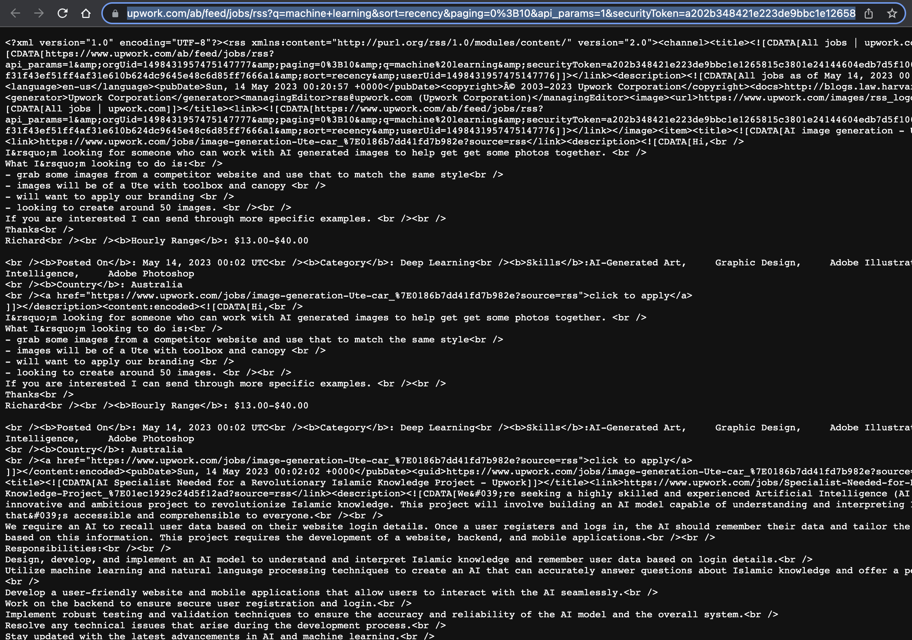
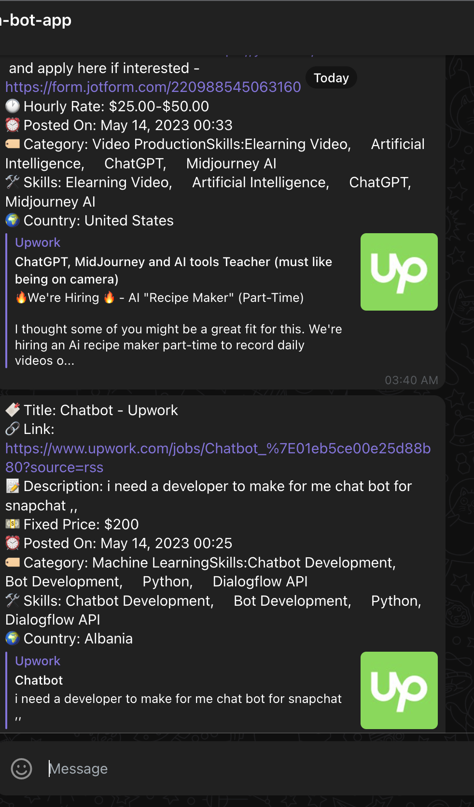

# Upwork Telegram Bot :robot:
This repository contains the code for a Telegram bot that fetches new job posts from Upwork using Upwork's RSS links. If you're looking to stay updated with new job posts from Upwork, you're in the right place! 

## Prerequisites
Before we start, make sure you have Python3 and pip installed on your machine.

## Step 1: Create Your Own Telegram Bot
Creating a bot on Telegram is a simple process with BotFather. Here's how you can do it:

1. Open your Telegram app and search for `BotFather`.
2. Click on the `BotFather` channel and then click on `/newbot` to create a new bot.
3. Follow the instructions given by BotFather. At the end of the process, you'll receive a token for your bot. Keep this safe, as we'll need it later!

Here's an example of what the BotFather channel looks like:


## Step 2: Configuring the Bot
Next, we need to set up some environment variables for our bot.

1. In the root directory of the repository, create a new file and name it `.env`.
2. Open the `.env` file and add your bot token in the following format: `TOKEN=<Your-Bot-Token>`. Make sure it looks similar to the format in the `.env.example` file. For reference, see: [Example .env](./.env.example)
3. Add another variable to the `.env` file to set the time interval (in seconds) for checking the RSS URLs. The format should be `TIME_INTERVAL=<Time-In-Seconds>`.

## Step 3: Install the Required Python Libraries
The `requirements.txt` file contains all the Python libraries that you need to run the bot. You can install them using pip with the following command:

```bash
pip3 install -r requirements.txt
```

## Step 4: Run the Bot :rocket:
You're almost there! Now that you've set up everything, you can start the bot using this command:

```bash
python3 main.py
```

## Step 5: Getting an RSS URL from Upwork :scroll:
To monitor specific job posts on Upwork, you need to get the RSS URL for your search criteria. Here's how to do it:

1. Open [Upwork.com](https://www.upwork.com) and navigate to `Find Work`.
2. Enter your search keyword in the search box and press `Search`.
3. After the page loads, scroll down to the bottom of the page where you'll find the `RSS` button. Click on it.

   

4. A new page with XML content will open. Copy the URL from the address bar; this is your RSS URL.

   

Great job! You now have the RSS URL that you need for the bot. 

## Step 6: Chat with Your Bot :speech_balloon:
Now, it's time to put your bot to use:

1. Open your Telegram bot by searching its name in the Telegram app.
2. Send your RSS URL as a message to the bot.

   

That's it! Now your bot will start fetching new job posts from Upwork according to the RSS feed you provided. Happy job hunting!
