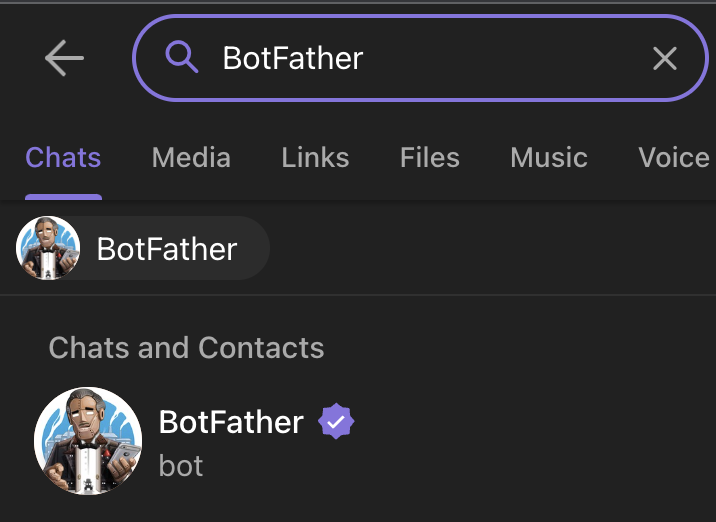

# upwork-telegram-bot
Telegram bot for getting new job posts on Upwork utilizing Upwork's rss links.

## Creating Your Own Telegram Bot
1- In Telegram search, enter `BotFather`

2- You will find the channel, enter and make a new bot /newbot

3- You will get a bot token for your own telegram bot.

## Configuring the Bot.

1- In the main directory of the repo, make `.env` file. 

2- Put the bot token in `.env` same format as `.env.example` file. see: [Link Text](./.env.example)

